# WITS Database Schema ERD

```mermaid
erDiagram
    %% Authentication & Authorization
    Users {
        int Id PK
        string Username
        string Email
        string PasswordHash
        string FirstName
        string LastName
        bool IsActive
        bool IsAdmin
        datetime LastLoginAt
        datetime CreatedAt
        datetime UpdatedAt
        int DefaultOrganizationId FK
    }

    Roles {
        int Id PK
        string Name
        string Description
        datetime CreatedAt
    }

    UserRoles {
        int UserId PK,FK
        int RoleId PK,FK
        datetime CreatedAt
    }

    Permissions {
        int Id PK
        string Name
        string Description
        datetime CreatedAt
    }

    RolePermissions {
        int RoleId PK,FK
        int PermissionId PK,FK
        datetime CreatedAt
    }

    RefreshTokens {
        int Id PK
        int UserId FK
        string Token
        datetime ExpiresAt
        datetime CreatedAt
    }

    %% Organization Management
    Organizations {
        int Id PK
        string Name
        string Description
        string Website
        string Email
        string Phone
        string Address
        datetime CreatedAt
        datetime UpdatedAt
        int CreatedByUserId FK
    }

    OrganizationMembers {
        int Id PK
        int OrganizationId FK
        int UserId FK
        string Role
        datetime CreatedAt
    }

    %% Project Management
    Projects {
        int Id PK
        string Name
        string Description
        datetime CreatedAt
        datetime UpdatedAt
        int CreatedByUserId FK
        int OrganizationId FK
    }

    ProjectMembers {
        int Id PK
        int ProjectId FK
        int UserId FK
        string Role
        datetime CreatedAt
    }

    ProjectTasks {
        int Id PK
        int ProjectId FK
        string Title
        string Description
        string Status
        string Priority
        int AssignedToUserId FK
        datetime CreatedAt
        datetime UpdatedAt
        datetime DueDate
    }

    ProjectComments {
        int Id PK
        int ProjectId FK
        int UserId FK
        string Content
        datetime CreatedAt
    }

    %% Ticket Management
    TicketTypes {
        int Id PK
        string Name
        string Description
        datetime CreatedAt
    }

    TicketPriorities {
        int Id PK
        string Name
        string Description
        datetime CreatedAt
    }

    TicketStatuses {
        int Id PK
        string Name
        string Description
        datetime CreatedAt
    }

    Tickets {
        int Id PK
        string Title
        string Description
        int TypeId FK
        int PriorityId FK
        int StatusId FK
        int ProjectId FK
        int CreatedByUserId FK
        int AssignedToUserId FK
        datetime CreatedAt
        datetime UpdatedAt
        datetime DueDate
    }

    TicketComments {
        int Id PK
        int TicketId FK
        int UserId FK
        string Content
        datetime CreatedAt
    }

    TicketAttachments {
        int Id PK
        int TicketId FK
        string FileName
        string FilePath
        int FileSize
        string ContentType
        int UploadedByUserId FK
        datetime CreatedAt
    }

    TicketHistory {
        int Id PK
        int TicketId FK
        int ChangedByUserId FK
        string FieldName
        string OldValue
        string NewValue
        datetime CreatedAt
    }

    %% Activity & Notifications
    Activities {
        int Id PK
        string Type
        string Description
        string EntityType
        int EntityId
        int UserId FK
        int OrganizationId FK
        int ProjectId FK
        int TicketId FK
        string Data
        datetime CreatedAt
    }

    ActivityComments {
        int Id PK
        int ActivityId FK
        int UserId FK
        string Content
        datetime CreatedAt
    }

    Notifications {
        int Id PK
        int UserId FK
        string Type
        string Title
        string Message
        bool IsRead
        int ActivityId FK
        int ProjectId FK
        int TicketId FK
        datetime CreatedAt
    }

    %% Relationships - Auth
    Users ||--o{ UserRoles : has
    Roles ||--o{ UserRoles : has
    Roles ||--o{ RolePermissions : has
    Permissions ||--o{ RolePermissions : has
    Users ||--o{ RefreshTokens : has

    %% Relationships - Organization
    Organizations ||--o{ OrganizationMembers : has
    Users ||--o{ OrganizationMembers : belongs_to
    Organizations ||--o{ Projects : owns
    Users ||--o{ Organizations : created
    Users }|--o| Organizations : default_org

    %% Relationships - Projects
    Projects ||--o{ ProjectMembers : has
    Users ||--o{ ProjectMembers : belongs_to
    Projects ||--o{ ProjectTasks : has
    Users ||--o{ ProjectTasks : assigned_to
    Projects ||--o{ ProjectComments : has
    Users ||--o{ ProjectComments : created
    Users ||--o{ Projects : created

    %% Relationships - Tickets
    Tickets ||--o{ TicketComments : has
    Users ||--o{ TicketComments : created
    Tickets ||--o{ TicketAttachments : has
    Users ||--o{ TicketAttachments : uploaded
    Tickets ||--o{ TicketHistory : has
    Users ||--o{ TicketHistory : changed
    TicketTypes ||--o{ Tickets : type
    TicketPriorities ||--o{ Tickets : priority
    TicketStatuses ||--o{ Tickets : status
    Projects ||--o{ Tickets : has
    Users ||--o{ Tickets : created
    Users ||--o{ Tickets : assigned_to

    %% Relationships - Activities
    Activities ||--o{ ActivityComments : has
    Users ||--o{ ActivityComments : created
    Users ||--o{ Activities : performed
    Organizations ||--o{ Activities : contains
    Projects ||--o{ Activities : related_to
    Tickets ||--o{ Activities : related_to

    %% Relationships - Notifications
    Users ||--o{ Notifications : receives
    Activities ||--o{ Notifications : triggers
    Projects ||--o{ Notifications : related_to
    Tickets ||--o{ Notifications : related_to
```

This ERD diagram shows all tables and their relationships in the WITS database. The diagram is organized into several sections:

1. Authentication & Authorization
   - Users, Roles, Permissions, and their relationships
   - Token management

2. Organization Management
   - Organizations and their members
   - Organization-Project relationships

3. Project Management
   - Projects, tasks, and comments
   - Project membership

4. Ticket Management
   - Tickets with types, priorities, and statuses
   - Ticket attachments, comments, and history

5. Activity & Notifications
   - System-wide activity tracking
   - User notifications
   - Activity comments

The relationships are shown using crow's foot notation:
- `||` One (exactly one)
- `|o` Zero or one
- `}o` Zero or many
- `}{` One or many

For example:
- `Users ||--o{ UserRoles` means "One user has zero or many user roles"
- `Organizations ||--o{ Projects` means "One organization has zero or many projects"
